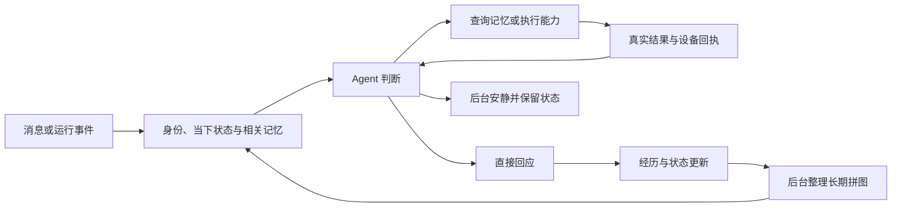
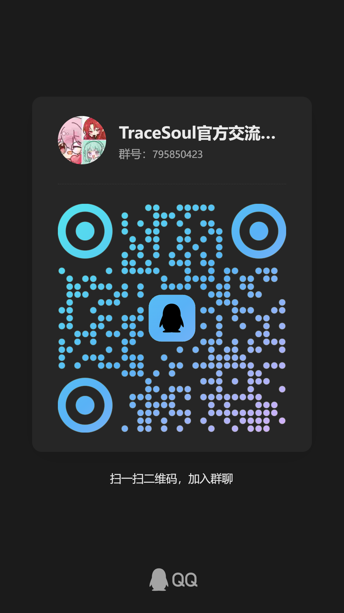

<div align="center">

# TraceSoul2

**让共同经历留下痕迹，让相处拥有连续性。**

一个可以自托管、持续记忆、按需行动的 AI 陪伴框架。

[下载最新版](https://github.com/TYty0728/TraceSoul2/releases/latest) · [快速开始](#快速开始) · [更新记录](docs/RELEASES.md) · [加入官方群](https://qm.qq.com/q/kJDFILm14A)

</div>

---

## 关于 TraceSoul

**ta 陪伴你的时光，成为了一部分的你。**

TraceSoul 想承载的是一段持续发生的相处：聊过的事情有出处，对彼此的理解会随着经历修正，此刻的心情和关注能够延续，你明确提出的希望也能影响之后的回应。

长期的记忆、认知与人格构成一幅拼图，当下的内心状态连接这幅拼图与正在发生的事情。框架将它们带入同一个 Agent 循环，由当前情境决定直接回答、查找记忆，或使用工具后继续行动。

项目仍在持续迭代。当前提供 **Windows x64、Linux x64、Linux arm64** 安装包，支持 WebUI 管理与更新。

## 现在可以做什么

| 能力 | 相处中的作用 |
|---|---|
| 自然对话 | 资料充分时一次生成直接回复；需要查资料或执行行动时再继续处理，明确需要润色才调用表达加工。 |
| 长期记忆与认知 | 保存共同经历及来源，按需召回；后台整理、形成和修订理解，保留支持与反对的证据。 |
| 偏好、约定与目标 | 在当轮记录明确反馈和当下／未来目标；有效内容持续参与后续回应，支持修订、撤回与完成。 |
| 当下状态与主动联系 | 保留情绪、关注和活动状态，通过心跳重新判断是否联系；收到用户消息需要回应，后台可以安静。 |
| QQ 与多种表达 | 通过 OneBot / NapCat 接入 QQ；按已配置能力使用文字、照片或语音。表情包由发送侧自动匹配，不占 Agent 的能力提示。 |
| 按需联网 | Tavily 插件提供搜索与网页读取；配置 Key 后按需使用，结果带来源，不把网络内容当成新的指令。 |
| WebUI 与自托管 | 管理角色、模型、记忆、平台与插件，查看运行状态和日志；软件与角色数据分开存放。 |

语音、生图、识图和联网需要配置对应服务。偏好提取、记忆理解与表达效果仍受所选模型影响；保存未来目标也不等于创建精确定时提醒。

## 一幅拼图，四个视角

| 视角 | 理解的内容 |
|---|---|
| **他** | 正在与 ta 相处的人、经历、偏好与变化 |
| **世界** | 共同接触的人、事物、环境与知识 |
| **我** | 自身的经历、性格、感受与选择 |
| **我和他** | 共同历史、相处方式、约定与关系 |

同一段经历可以连接多个视角。长期拼图与当下状态共同参与回应；新的真实经历又成为理解变化的依据。设计与实现见 [四领域认知拼图](docs/COGNITION_PUZZLE.md) 和 [偏好与目标记忆](docs/GOAL_MEMORY.md)。



详细执行边界见 [Agent 运行框架](docs/AGENT_HARNESS.md)。框架已提供语音与动作的执行、回执和取消契约；机器人、Live2D 等具体设备驱动仍需接入。

## 快速开始

### 下载运行

1. 前往 [GitHub Releases](https://github.com/TYty0728/TraceSoul2/releases/latest)，下载对应系统和架构的 ZIP。常规发布包需要 **.NET 8 SDK 或对应架构的 ASP.NET Core 8 运行时**。
2. 将安装包解压到独立的 `App` 目录，使用包内的 `Start-TraceSoul2.cmd`（Windows）或 `Start-TraceSoul2.sh`（Linux）启动。
3. 打开 `http://127.0.0.1:5080`。首次启动的管理员账号为 `admin`，随机密码在启动日志中显示一次；登录后按提示修改。
4. 在 WebUI 配置角色和模型服务，先完成本机对话，再按需启用 QQ、语音、生图或联网插件。

启动脚本默认将软件与数据放在并列目录中：

```text
TraceSoul2/
├─ App/              # 软件与启动脚本
├─ Data/             # 角色、记忆、全局设置与更新数据
├─ Plugins/          # 插件代码包
└─ plugins_data/     # 插件配置、图库与持久数据
```

在 WebUI「系统更新」中检查并安装正式版本。更新替换软件和随包维护的官方插件代码，保留角色与插件配置；迁移或备份时也应保留 `Data`、`Plugins` 和 `plugins_data`。详见 [版本与更新](docs/RELEASES.md)。

### Ubuntu / Docker

准备好 Git LFS、Docker Engine 和 Compose 插件后：

```bash
git clone https://github.com/TYty0728/TraceSoul2.git
cd TraceSoul2
git lfs pull
chmod +x scripts/*.sh
./scripts/docker-up.sh
```

Docker 提供 .NET 运行环境，软件与数据保存在宿主机的 `runtime/`。远程访问可以使用 SSH 隧道：

```bash
ssh -L 5080:127.0.0.1:5080 user@server
```

然后在自己的电脑打开 `http://127.0.0.1:5080`。迁移、首次登录、HTTPS 与域名配置见 [Docker 部署指南](docs/DOCKER.md)。

### 接入 QQ

在 WebUI「平台 · QQ」配置 OneBot v11 / NapCat。默认使用反向 WebSocket，NapCat 连接 `ws://127.0.0.1:9021/ws`；跨主机或容器部署时按实际网络调整地址。

平台负责消息收发，插件提供语音、相机、空间等能力。排障与发送行为见 [QQ 使用与排障](docs/knowledge/QQ_RUNBOOK.md)。

## 插件与扩展

能力按 **内核 → 平台／身体 → 器官** 组织。平台连接决定其所属器官是否可用；独立计算工具可以跨平台使用。外部插件通过共享的 `TraceSoul2.PluginApi` 接入，不需要重新编译宿主。

| 插件 | 用途 | 分发方式 |
|---|---|---|
| `qq-tts` | QQ 情感语音 | 随包提供，需配置服务 |
| `qq-imagegen` | 规划画面、生图与发图 | 随包提供，需配置服务 |
| `qq-qzone` | 读取与发布说说 | 随包提供 |
| `qq-status` | QQ 签名与在线状态 | 随包提供 |
| `game-session` | 一起玩的会话工作台 | 随包提供，游戏端按需接入 |
| `media-understanding` | 媒体来源识别与内容理解 | 随包提供，需配置相关能力 |
| `realtime-call` | 转写、回复与播放回执衔接 | 随包提供，需外部音频客户端或网关 |
| `tavily` | 搜索与网页读取 | 随包提供，需 Tavily API Key |
| `qq-sticker` | 根据当前情绪语境自动匹配表情／GIF | 独立安装，需表情库 |

实时通话插件当前提供转写到对话、再到客户端播放的链路，音频采集与合成由外部客户端处理。具体接入范围见 [实时通话说明](ExternalPlugins/RealtimeCall/README.md)。

开发插件可从 [插件开发指南](docs/PLUGINS.md)、[PluginApi](Tools/PluginApi/README.md) 和 [插件分层](docs/PLUGIN_LAYERS.md) 开始。

## 开发与文档

源码开发需要 .NET 8 SDK 和 Git LFS。在仓库根目录执行：

```powershell
git lfs pull
dotnet build TraceSoul2.sln

dotnet run --project Tools/Host/TraceSoul2.Host.csproj
```

离线回归使用模拟模型与临时数据，不调用真实模型 API：

```powershell
dotnet run --project Tools/ChatCheck/ChatCheck.csproj
```

| 入口 | 内容 |
|---|---|
| [项目知识库](docs/knowledge/README.md) | 当前状态、开发与排障导航 |
| [架构地图](docs/knowledge/ARCHITECTURE.md) | 运行链路与模块职责 |
| [Agent 框架](docs/AGENT_HARNESS.md) | 直接回复、工具续推与多模态行动 |
| [输出契约](docs/AGENT_OUTPUT_CONTRACT.md) | 模型输出结构与插件注入边界 |
| [Prompt 装配](docs/PROMPT_ASSEMBLY.md) | 上下文组织与缓存 |
| [版本说明](docs/RELEASES.md) | 已发布功能与更新方式 |
| [工作约定](AGENTS.md) | 源码修改与验证规则 |

核心源码位于 `src/TraceSoul2/`，宿主位于 `Tools/Host/`，官方插件位于 `ExternalPlugins/`。运行密钥、Cookie、角色数据库和私人聊天保留在数据目录，不提交到仓库。

## 交流与反馈

欢迎交流使用体验、反馈问题，也欢迎一起讨论记忆、认知与陪伴的设计。

- **作者 QQ：2508837950**
- **官方群：TraceSoul官方交流群(1群)**
- **群号码：795850423**
- [点击链接加入群聊【TraceSoul官方交流群(1群)】](https://qm.qq.com/q/kJDFILm14A)
- [GitHub Issues：提交问题或建议](https://github.com/TYty0728/TraceSoul2/issues)

使用 QQ 扫描下方二维码加入群聊，点击图片可查看原图。

<p align="center">
  <a href="docs/assets/qq-group-795850423.png">
    
  </a>
</p>
