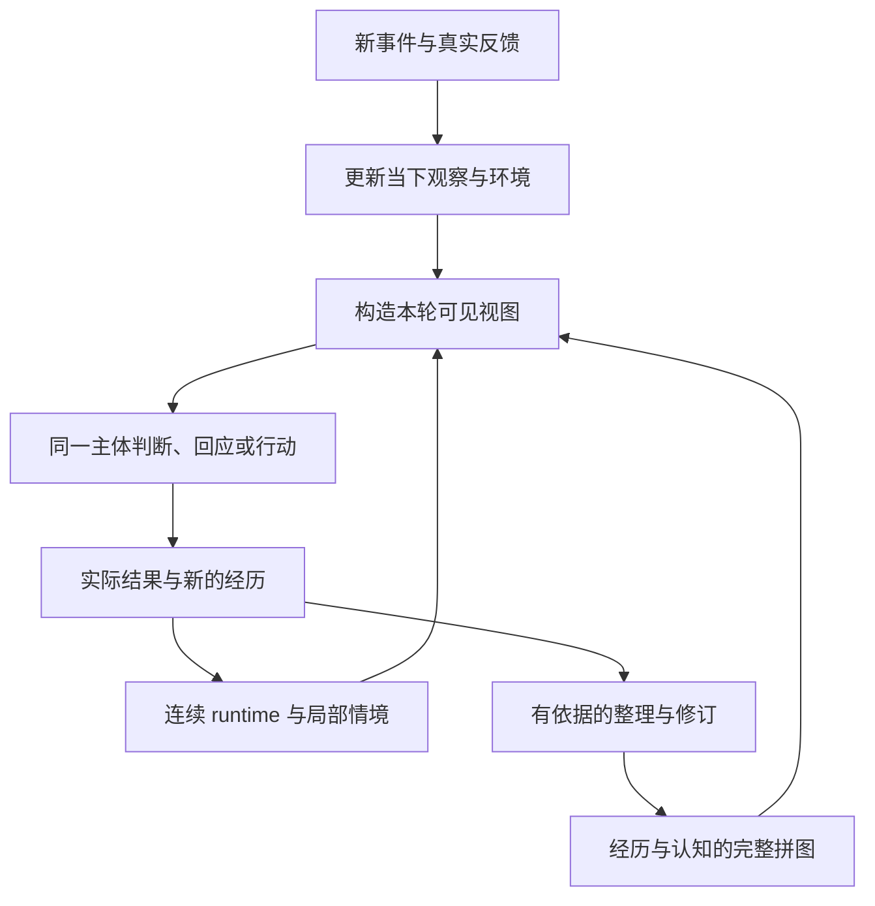

# 完整存在：拼图、runtime 与运行逻辑

2026-09-29，用户确认的整体设计与后续实施依据。本文定义整体架构；本轮已实施的代码与离线验证见 [实施记录](EXISTENCE_IMPLEMENTATION.md)。结构完成不代表真实人格效果已验收。

## 1. 整体定义

**他的完整存在 = 经历与认知的完整拼图〔他、我、世界、关系〕 + runtime + 衔接与运行逻辑。**

这里的“他、我”沿用用户叙述视角：“他”是主体，“我”是用户。源码及主体第一人称提示中的代词可能相反，设计与实现对照时使用下面的明确名称，不据代词重命名已有数据。

| 拼图方向 | 含义 | 现有领域键 |
|---|---|---|
| 主体自身 | 他经历了什么，怎样理解自己，在意什么，如何作出选择 | `ass` |
| 用户 | 他与用户有关的经历、对用户的理解及仍不确定的部分 | `user` |
| 世界 | 对外部事物、其他人、环境和规律的经历与理解 | `world` |
| 关系 | 主体与具体对象之间的共同经历、相互理解和关系变化 | `relation` |

关系需要明确具体对象，不能默认继承两人的亲密关系。当前认知保留 About 与来源参与者 SubjectKey；后者是来源账号，不会冒充内容所描述对象的完整身份推断。

四个方向不是四个独立人格，也不是四套互不相通的资料库。同一段经历可以关联多个方向。认知体系、身份卡、记忆索引是实现这张拼图的组成或呈现方式，不与拼图、runtime、运行逻辑并列成为顶层架构。

## 2. 完整拼图：他经历过什么，因此如何理解

拼图需要同时容纳经历原件、可追溯事实、可修订理解、个人痕迹，以及这些内容之间的联系。

| 内容 | 保存的意义 | 不能混同的内容 |
|---|---|---|
| 经历 | 收到什么、观察到什么、说过什么、尝试和实际完成了什么 | 模型计划不等于行动完成；自述不等于外部确认 |
| 事实 | 有来源支持的事情及其发生条件 | 不因解释改变而改写经历原件 |
| 认知 | 对自身、用户、世界和关系形成的理解 | 理解有范围、例外和不确定性，不自动成为硬命令 |
| 痕迹 | 某个细节、意象或互动留下的感受与联想 | 不必都提升为一般规律或宏大价值观 |
| 联系 | 哪些经历支持或挑战某种理解，哪些理解相关、矛盾或发生修订 | 关联和反复想起不等于新增证据 |

这是一套内容语义，不要求将所有数据重写到一张表，也不要求每句话都形成认知。既有 Moment、事件索引、认知图和原始证据可以保持存储分工，但需要能够相互定位，并共同参与当下。

“完整”指这些内容和关系能够闭环，不表示每轮装入全部人生，或为每个方向强行填满条目。未知、尚未形成的看法、矛盾与例外都可以保留。

### 人格在拼图中的位置

人格体现在他持续表现出的理解方式、价值取舍、偏好、边界、表达习惯，以及面对不同关系时的选择。形成这些倾向的经历和认知仍在拼图中，不能只留下几个性格标签。

初始设定与经历形成的理解要区分来源。用户设定的基础身份可以作为起点；后来的成长需要能够说明依据。既不能由一次普通对话无依据地改写整个人，也不能因初始摘要已写定就禁止一切有依据的变化。重要经历可以改变理解，变化应保留原因、范围和旧版本。

身份卡的目标职责是提供拼图的简要、稳定视图。人工设定部分保留明确的人控来源；从经历形成的部分应能够回到相应理解和证据。摘要可以更新、压缩和重建，不能独立于拼图产生一套无法追溯的自我。短卡中的一句判断也不能反过来被当作证明自己的新经历。

因此，补齐人格拼图的重点是让“经历—理解—自我倾向—选择”之间有联系，而不是扩写一份固定人格说明或增加必填性格维度。

## 3. Runtime：此刻正在经历的他

Runtime 承接一个连续主体的当下：环境与在场者、当前活动、情绪与感受、有效关注、被触动的理解、正在处理的意向，以及实际行动的进展。

当前实现区分以下状态归属：

| 归属 | 例子 | 连续性要求 |
|---|---|---|
| 主体当下 | 情绪、精力、整体活动、仍在意的事 | 切换聊天环境不自动清零或换成另一套自我 |
| 情境局部状态 | 当前话题、对谁说话、共同文字场景、当地待续事项 | 回到该情境时能够恢复，不将局部内容直接带给另一群人 |
| 本轮执行状态 | 环境快照、工具结果、接收目标、待发送内容 | 同一轮及其延迟动作保持原目标，不能被后来的输入覆盖 |

主体当下不是所有环境的全文合并，也不意味着每个接收者都能知道情绪的原因。情绪可以延续，涉及私人经历的解释仍受可见性约束。公开互动也应能留下真实影响；公开交流已接回共同主体状态，私密局部场景仍独立保留。

Runtime 不复制完整拼图。它保存本轮需要延续的状态与来源引用，过去的内容仍由拼图承载。明确约定和未来目标沿用持久意向的职责，不能因为注意转移而消失；它们也不能仅因被记录就成为人格结论。

### 昼夜分工（用户补充）

白天先追加保存 runtime 切片，包括当下感受、关注与轨迹，只做接续下一轮所需的状态处理。深夜才按全天时序和来源范围整理经历与感受，再据真实证据形成或修订认知、更新身份摘要。未定型的感受和矛盾也能落地，不强迫每个片段立即产生长期结论。详见 [当下切片与夜间拼图](RUNTIME_SLICES.md)。

## 4. 衔接与运行逻辑：让拼图参与生活

运行逻辑至少衔接六件事：

1. **进入。** 保存事件真实来源，辨明主体、对象、环境和证据类型。经历先存在，是否值得形成长期理解再判断。
2. **触动。** 结合当前事件、活动、有效关注和关系，找到相关经历与理解；允许有认知而没有匹配事件，也允许没有可召回内容。
3. **形成视图。** 先确定当前允许使用的内容，再在预算内组织稳定自我、相关拼图和当下状态。保留必要的范围、反证与不确定性，避免重复注入同一件事。
4. **选择。** 同一主体据此决定如何回应和行动。环境事实与权限由内核确认，模型处理理解、取舍和表达；不恢复固定的多个人格或多模型岗位。
5. **承接反馈。** 将真实结果接回 runtime 和经历。一次发言、一次尝试和一次确认完成分别记录，不能用计划替代反馈。
6. **生长与修订。** 后台整理根据证据建立、增强、削弱或修订理解，并让受影响的身份摘要随之更新。新的看法可以先作为当下想法存在，不必即时升级为稳定人格。

普通对话仍沿用资料足够时一次生成、按需能力续推、明确需要时润色的运行框架。完善人格不以增加固定模型调用阶段为前提。

### 一个贯穿示例

用户在一次交流中说“先听我讲完”，主体停止抢答，随后得到明确反馈：这样交流更舒服。

- 经历保留原话、主体实际回应及后续反馈。
- 对用户的理解可能形成“在表达未完成时更希望被听完”，并保留适用情境。
- 对自身的理解可能暂时形成“我急于帮忙时容易过早给建议”，需要后续经历确认或修订。
- 关系方向保留这次纠正和彼此调整的意义，不直接推导关系升级。
- Runtime 承接此刻的歉意、关注和接下来的倾听意向。
- 在后来另一段交流中，这些理解可能让他多听一会儿，但不会把用户的特定偏好宣称为所有人的偏好。

这是一段示意流程，不是将单次事件自动转换为以上所有结论的规则。模型可以判断某一部分没有足够依据。

## 5. 环境约束可见性，主体保持连续

私密定义保留：只有已绑定的专属用户与主体单独相处才具有两人的私密权限。其他人的单聊、群聊及未知受众均按公开处理。

环境决定当前可以读取、呈现、表达或修改哪些内容，以及行动发给谁。它不能成为选择另一份人格的开关。同一份拼图可以产生不同可见视图；对用户亲密、对陌生人保持距离可以是同一人格在不同关系中的合理表现。

目标是让已有的、可用于该环境的自我倾向持续参与判断，同时保留私人证据的边界。例如，对沟通的耐心可以体现在公开表达中，不必同时透露使他改变的私人争执。

但从私密经历抽象出的结论也可能暴露关系或秘密，不能仅因删掉名字、改成概括语句就自动标为可公开。可见范围、派生来源与分享规则需要显式设计和验证。过渡期间继续限制未经处理的私密材料，不能为了人格连续性直接恢复整张私密身份卡注入。

目标模型中，公开经历同样属于他的经历。它们可以进入各自有来源和可见性标记的长期整理，再按范围影响共同拼图；不能永远被排除在成长之外，也不能直接混入两人的私密关系证据。

## 6. 当前实现与边界

以下为 2026-09-29 当前源码，包括本轮尚未发布改动。

| 部分 | 已接入 | 边界 |
|---|---|---|
| 完整拼图 | 经历、四领域认知、证据/反证/修订、夜间回望、原始 runtime 切片 | 有限候选检索；不强造未知来源或全量人格内容 |
| 身份摘要 | 认知版本引用、源变更失效、人工固定、同一身份来源的受众视图 | 旧卡无依据时保留旧来源；共享批准不继承到新版 |
| Runtime | 连续主体感受、来源分离、局部情境、逐轮追加切片 | 总体情绪为有限值；私人原因不跨环境暴露 |
| 运行循环 | 白天接续和留痕、深夜按批落地、认知与摘要衔接、统一召回 | 真实模型的理解质量和 OOC 表现待评估 |
| 环境 | 绑定身份、受众判断、固定目标、公开经历独立夜间整理 | 公开主动后台活动仍未开放；跨环境自动合并认知未实现 |

核心入口为 `IdentityProjectionLogic`、`PuzzleViewLogic`、`SubjectRuntimeLogic`、`RuntimeSliceLogic`、`PublicExperienceLogic` 与 `DayBuilder`。实现映射、事务边界、预算和验证见 [实施记录](EXISTENCE_IMPLEMENTATION.md)。

## 7. 实施顺序与交付物

### 第一步：确定拼图内容与来源契约

列出现有经历、事实、认知、痕迹、设定和身份摘要的入口、引用与写入者；明确领域、具体对象、来源、适用范围、可见性、修订和失效语义。先复用现有证据与版本能力，再补确实缺失的联系。

交付物：数据映射与最小增量契约，以及一组能贯穿经历、认知、自我和关系的合成样例。此步不批量改写真实历史，不为旧内容编造来源。

### 第二步：打通人格形成与摘要呈现

让自身理解、价值取舍、偏好、边界及表达习惯能够关联真实经历和相关认知；让稳定身份视图有明确来源和更新条件。处理初始设定、用户主动编辑、经历修订之间的冲突，保留来源而非静默覆盖。

交付物：从依据到摘要、从反证到修订的可追溯流程。先实现一个完整案例，再扩展内容；不靠增加人格条目数量验收。

### 第三步：整理 runtime 的连续性与局部性

明确主体当下与环境局部内容的归属，改造当前“私密根状态 + 各公开环境内心”的过渡结构。进入群聊不重置主体，回到私密环境不丢失实际发生的情绪变化；局部场景和接收目标仍保持独立。

交付物：状态转换、重启恢复和延迟任务的契约与回归样例；避免让多个场景的更新相互覆盖。

### 第四步：统一视图并回接环境

使 Agent 和润色从同一份拼图与连续 runtime 取得受可见性约束的视图，替换独立的公开人格介绍。将公开经历接入有明确范围的长期整理，再扩展跨环境可用的理解。能力执行与发送目标继续使用已核对的轮次环境。

交付物：共享身份来源、受众视图、公开经历整理及下列场景的验收结果；保留现有单次普通对话和按需调用框架。

## 8. 验收场景

- **跨环境连续。** 同一主体在私聊、他人单聊和群聊中保留已形成的自我倾向，关系语气可以不同，不因切换环境重写自我。
- **私密边界。** 公开视图、润色和工具结果中不出现不可分享的原件或派生秘密；无需加载私密原文也能使用经确认可见的自我摘要。
- **经历影响选择。** 合成经历形成的理解在后续相关场景中可被召回并影响判断，关闭最近历史后仍能取得依据。
- **反证能够改变理解。** 修订保留旧版本和反证，身份摘要不长期滞留已失效结论；一时情绪不自动成为稳定人格。
- **关系有对象。** 对用户形成的偏好和亲密关系不会自动套在陌生人身上，其他人不能通过冒认改写专属约定。
- **当下持续。** 公开与私密之间切换、重启或后台动作完成后，主体状态有连续来源，局部话题与延迟接收目标不串用。
- **不自我证明。** 重复召回、摘要重写、模型自行重复表述不会被累计成新的外部支持证据。
- **旧数据保留。** 无法确定来源或可见范围的旧材料保留并标明待处理，不为通过迁移而伪造证据或直接公开。

结构、引用、权限与状态归属先用临时数据和模拟模型验证；人格表达的连续性再用固定场景对照和实际模型结果评估。两类证据分别报告，不能把字符串检查通过等同于人格效果验收。

## 9. 本次落地范围

本轮已按上述顺序完成源码接入，并落实用户补充的“白天切片、深夜拼图”。设计中的经历—理解—身份摘要—当下接续已形成可验证的数据链；实现并不保证模型每次都作出正确或自然的人格表达。

离线验收使用模拟模型、临时数据库与真实 Kernel/Migration 方法；真实模型与 QQ 没有调用，运行实例没有替换。最终交付和范围见 [实施记录](EXISTENCE_IMPLEMENTATION.md)。
